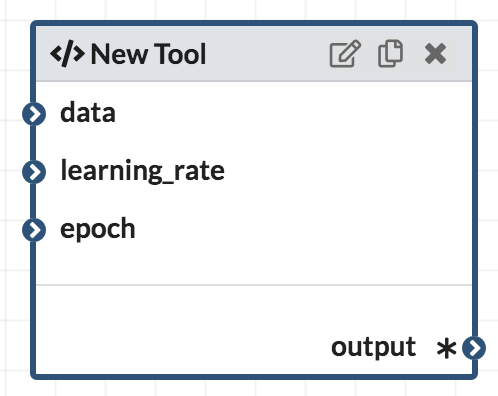

# CodaLang, a domain specific language for [CodaLab](https://worksheets.codalab.org/) <!-- omit in toc -->

CodaLang is a DSL for submitting computation commands to [CodaLab](https://worksheets.codalab.org/). Originally designed for [Workflow](https://github.com/jyh1/workflow), it provides a high level construct for defining reusable functions upon the CodaLab [CLI](https://codalab-worksheets.readthedocs.io/en/latest/CLI-Reference/).

## Table of contents
- [Table of contents](#table-of-contents)
- [Getting started](#getting-started)
- [Build](#build)
- [Tutorial](#tutorial)
  - [Example 1](#example-1)
  - [Defining a Pipeline](#defining-a-pipeline)
  - [Function](#function)
  - [Run Options](#run-options)
  - [String Expression](#string-expression)
  - [Record](#record)
  - [Types](#types)

## Getting started

The easiest way to experiment with CodaLang is through the [demo web app](http://13.82.168.247/demo/codalang/), it will compile the input CodaLang expression to shell script based on CodaLang CLI. For actually using CodaLang, check out the [Workflow](https://github.com/jyh1/workflow), a LabVIEW-like visual programming interface for CodaLab.

## Build
This package is intended to be used as a library, but it comes with a minimal CLI for interpreting CodaLang file through the system `cl` command. It can be built with [stack](https://tech.fpcomplete.com/haskell/get-started)
```bash
stack build && stack test
```

## Tutorial

> **_Tip:_** You can copy/paste the example programs from this tutorial to the [demo web app](http://13.82.168.247/demo/codalang/) to see the actual compiled results.

> **_Note:_** This tutorial assumes you already have a working knowledge about CodaLab. If not, a quick start guide can be found [here](https://github.com/codalab/worksheets-examples).


CodaLang is a simple typed functional programming language. A program contains a single expression which is composed of many smaller ones. CodaLang programs will usually be compiled to a series of `cl` commands.

### Example 1
A simple program looks like this:
```haskell
let 
    a = 0x3b5f831f09f04a22bcd3020b7a1cb69c;
    sort = 0xd4c5712c156f41e48e6400f05cc5441c;
in
    @ python $sort < $a @
```

The program structure is simple. It contains a `let` expression, which introduces name binding for sub-expressions, multiple bindings are separated by a comma. The expression after keyword `in` is the "return value". 

In this example, the "return value" is a `run expression`, which is enclosed by a pair of `@` symbol. The syntax is similar to a string template, you can use the `$` sign to refer to the CodaLang variables that are in scope. However, unlike string template, those variables will NOT be directly inlined with their contents, the whole expression will be translated to a `cl run` command with correct dependencies. The above example will become something like:
```shell
cl run  --name codalang-3  a-1:0x3b5f831f09f04a22bcd3020b7a1cb69c sort-2:0xd4c5712c156f41e48e6400f05cc5441c ' python sort-2 < a-1 '
```
You probably have figured out that the two long hexadecimal number prefixed with `0x` are bundle UUIDs. Indeed, they are `bundle literal` expressions and currently the only way to refer to existing bundles in the CodaLab. 

### Defining a Pipeline
The above example is a very simple program. A more involved computation "pipeline" could be written as:
```haskell
let 
    a = 0x3b5f831f09f04a22bcd3020b7a1cb69c;
    sort = 0xd4c5712c156f41e48e6400f05cc5441c;
    a2 = @cat $a $a@/stdout;
    a4 = @cat $a2 $a2@
in
    @ python $sort < $a4/stdout @
```
In this example, we assign names for the `run expression`s and create dependencies between them. During execution, the runtime system will record the returned UUID from the `cl run` command and use it to construct the next one. 

In the definition of `a2`, we used a path separator `/`. It means exactly what you are thinking, to specify sub-folder/file in the bundle. An expression like `<bundle>/path/.../path` is treated as a bundle in CodaLang, although it technically doesn't have a UUID associated with it in CodaLab. Note the slight difference in the definition of `a2` and `a4` and how they are used in the `run expression`. If you are familiar with CodaLang, it is the same difference between the commands `cl run a:0xfff 'cat a/stdout'` and `cl run a:0xfff/stdout 'cat a'`.

The corresponding shell script of the above program:
```shell
bundle_0=$(cl run  --name a2-3  a-1:0x3b5f831f09f04a22bcd3020b7a1cb69c 'cat a-1 a-1')
bundle_1=$(cl run  --name a4-5  a2-4:$bundle_0/stdout 'cat a2-4 a2-4')
bundle_2=$(cl run  --name codalang-6  a4-5:$bundle_1 sort-2:0xd4c5712c156f41e48e6400f05cc5441c ' python sort-2 < a4-5/stdout ')
```
 
### Function
If you still aren't sold on CodaLang, behold the "killer app" --- function definition. It was supposed to be a functional programming language after all!

```haskell
let 
    append[a: bundle, b: bundle] = @cat $a $b@/stdout;
    double[file: bundle] = append[a: file, b: file];
    quadruple = [a: bundle] => let a2 = double[file: a] in double[file: a2];
in
    quadruple[a: 0x3b5f831f09f04a22bcd3020b7a1cb69c]
```
We defined three functions here, `append`, `double` and `quadruple`. The syntaxes are slightly different, the form in the first two definitions is just a syntax sugar for the lambda form in `quadruple`. Take the definition of `append` as example, we first declare two arguments (`a` and `b`) along with their types (both are `bundle` inside a pair of square brackets, we will talk about type later). The body of the function is just a normal CodaLang expression with the declared argument variables in its scope. In  the lambda form: `[name: type ...] => expr`.

In the calling side, we need to provide a dictionary-like structure or so called "keyword arguments". The syntax is similar to the definition side, pairs of colon-separated name and expression: `function[name: expr ...]`.

The compiled script of this example:
```shell
bundle_0=$(cl run  --name a2-3  a2-1:0x3b5f831f09f04a22bcd3020b7a1cb69c 'cat a2-1 a2-1')
bundle_1=$(cl run  --name codalang-5  a2-4:$bundle_0/stdout 'cat a2-4 a2-4')
```

A few extra notes: CodaLang is designed to support the execution computation graphs of `Workflow`(https://github.com/jyh1/workflow). The `function` in CodaLang is closely modelled as a computation node like in [Galaxy](https://galaxyproject.org) or LabVIEW, with named input ports and output ports.


Function in CodaLang is currently more like macro. All functions will be eliminated after compilation after being used to generate `cl` command, because there is no control structure in CodaLang and every . However, it do behave like a value in the sense it can be passed around as an argument or as return value of another function with correctly implemented closure. It has a function type which will be discussed in the [type](#types) section. 

### Run Options
We can further specify options for `cl run` in the `run expression`.
```
@ --request-docker-image codalab/default --request-gpus 2 #echo Hello World@
```
Option specifications and command are separated by `#`. The above example will be compiled to:
```shell
bundle_0=$(cl run  --name codalang-1  --request-docker-image codalab/default --request-gpus 2   'echo Hello World')
```

### String Expression
String expression is similar to a regular string expression in other language. It is defined with a pair of double quote with common quotation rules.

```haskell
let lr = "1e-5" in @ echo $lr@
```
Compiled to:
```shell
bundle_0=$(cl run  --name codalang-1   ' echo 1e-5')
```

String expression will be inlined directly. Special shell characters like `$`, white space and etc will be quoted. String expression has type `string`, which could be passed as argument.
```
let 
    filter[max: string, gpuNum: string] = 
        # Comment starts with #
        # $ is quoted in the run-expression
        @ --request-gpus=$gpuNum # awk '(\$1 > $max){print \$2}' @
    
in
    filter[max: "5", gpuNum: "3"]
```
Compiled result:
```
bundle_0=$(cl run  --name codalang-1  --request-gpus=3   ' awk \'($1 > 5){print $2}\' ')
```

### Record
A record expression looks like:
```haskell
let a = 0x3b5f831f09f04a22bcd3020b7a1cb69c
in 
    {data1: 0xd4c5712c156f41e48e6400f05cc5441c
    , data2: a
    }
```
Record is just like a regular key-value pairs enclosed by `{}`. It is mainly used for defining function with multiple results. The value could be looked up using the `/` operator, just like specifying a subdirectory for a bundle: `{k1: v1, k2: v2 ...}/k1`.

```haskell
let 
    multiply[a: bundle] = 
        {
              double: @cat $a $a@/stdout
            , triple: @cat $a $a $a@/stdout
        };
    sextuple[file: bundle] = 
        let doubled = multiply[a: file]/double
        in multiply[a: doubled]/triple;
    data = 0x3b5f831f09f04a22bcd3020b7a1cb69c
in
    sextuple[file: data]
```
In this example, we `multiply` returns a record with two values: `double` and `triple`. The `sextuple` function is built by first picking the `double` key and then the `triple` key.

CodaLang acts like a "lazy" language, which means only the necessary commands that are required to compute the final result will be compiled. For example, even thought `multiply` is called twice, only two commands that are required in the final result are generated:

```
bundle_0=$(cl run  --name doubled-2  data-1:0x3b5f831f09f04a22bcd3020b7a1cb69c 'cat data-1 data-1')
bundle_1=$(cl run  --name codalang-7  doubled-4:$bundle_0/stdout 'cat doubled-4 doubled-4 doubled-4')
```

### Types
`string` expressions and `bundle` expressions are treated differently when generating the `cl` command, so CodaLang keeps track of the type for each expression and requires a type annotation when declaring arguments.

Some types of example expressions:

|  Expression |  Type  |
|:------------------:|:-----------:|
| "a string" | string |
| 0x3b5f8 | bundle |
| 0x3b5f8/stdout | bundle |
| let a="string" in a | string |
|{a: "aa", b: 0x3b5f8} | {a: string, b: bundle} |
| [a: bundle] => @cat $a@ | [a: bundle] => bundle|


